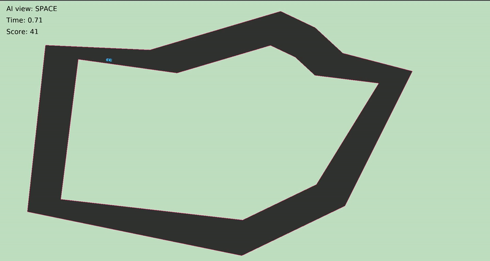

Implemented from my DQN framework: https://github.com/romainducrocq/frameworQ

****

### initial-DQN

Déjà vu, I've just been in this place before?  
https://www.youtube.com/watch?v=dv13gl0a-FA  

1. Train: `python3 train.py -algo PerDuelingDoubleDQNAgent -max_total_steps 18000000`.
2. Observe: `python3 observe.py -d save/PerDuelingDoubleDQNAgent_lr5e-05_model.pack -max_steps 500`.
3. Visualize: `tensorboard --logdir ./logs/`.
4. Play: `python3 play.py`.

****

### Software Requirements

- Python 3.7  
> sudo apt-get update && sudo apt-get install build-essential libpq-dev libssl-dev openssl libffi-dev sqlite3 libsqlite3-dev libbz2-dev zlib1g-dev cmake python3.7 python3-pip python3.7-dev python3.7-venv  

- venv  
> mkdir venv && python3.7 -m venv venv/  
> source venv/bin/activate  
> deactivate  

- pyglet, gym, torch, tensorboard, msgpack, wheel  
> (venv) pip3 install 'pyglet==1.5.0' gym torch tensorboard 'msgpack==1.0.2' wheel --no-cache-dir  

****

### Demo

