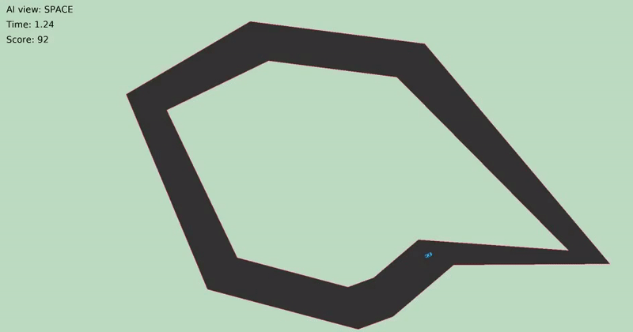

### initial-DQN

My own DQN library for custom environments. Supports:  
- Custom environments in OpenAI gym framework.  
- Dynamic save and load with msgpack.
- Multi-processing learning.  
- Tensorboard visualization.  

How to use:  
1. Create a custom environment in env/ with a pyglet view and a gym wrapper.  
2. Configure the hyperparameters and neural net architecture in dqn/config/dqn_config.py.  
3. Train the model with `python3 train.py -algo PerDuelingDoubleDQNAgent -max_total_steps 18000000`.  
4. Observe the AI with `python3 observe.py -dir save/PerDuelingDoubleDQNAgent_lr5e-05_model.pack -max_steps 500`.  
5. Visualize the learning curves in tensorboard with `tensorboard --logdir ./logs/`.  
6. And beat the AI with `python3 play.py` to assert dominance on the machines.  
 
The following algorithms are implemented:  
- DQN: vanilla DQN.  
- DDQN: Double DQN.  
- 3DQN: Dueling Double DQN.  
- Per3DQN: Dueling Double DQN with Priority Experience Replay.  

### Software Requirements

- Python 3.7  
> sudo apt-get update && sudo apt-get install build-essential libpq-dev libssl-dev openssl libffi-dev sqlite3 libsqlite3-dev libbz2-dev zlib1g-dev cmake python3.7 python3-pip python3.7-dev python3.7-venv  

- venv  
> mkdir venv && python3.7 -m venv venv/  
> source venv/bin/activate  
> deactivate  

- pyglet, gym, torch, tensorboard, msgpack, wheel  
> (venv) pip3 install 'pyglet==1.5.0' gym torch tensorboard 'msgpack==1.0.2' wheel --no-cache-dir  

### Demo

### How To Build a Custom Environment

This library provides a framework designed to wrap and support any custom environment for applying DQN algorithms. All sections to be modified are indicated by comments.
No uncommented section should require any modification, especially no code related to the DQN algorithms. Are to be modified only:
- The environment model folder `env/custom_env/`.
- The environment view file `env/view.py`.
- The environment controller wrapper file `env/custom_env_wrapper.py`.
- The entry programs interacting with the view `play.py` and `observe.py`.
- The DQN hyperparameter configuration file `dqn/config/dqn_config.py`.

1. **Model:**  
- In the `env/custom_env/` folder, create the environment model. Do so in an object-oriented fashion, as the transition dynamic is wrapped in an external controller. E.g: car.py, track.py, utils.py.  
2. **Controller wrapper:**  
- In `env/custom_env_wrapper.py`, wrap the environment controller in the `CustomEnvWrapper` class:  
	- 2.1: Import the environment model.  
	- 2.2: In `__init__`: construct the environment, define the feature scaling, the action/observation spaces.  
	- 2.3: Define the observation in `_obs`, the reward in `_rew`, the end condition in `_done`, add infos in `_info`.  
	- 2.4: Define the initial state in `reset`, the transition dynamics in `step`.  
	- 2.5: (Optional) Define rendering instructions in `reset_render` and `step_render`, for the view only.  
3. **View With Pyglet:**  
The implementation uses Pyglet for the view by default, and provides the two abstract methods `setup` and `loop`. The `Play` and `Observe` classes in the entry programs inherit from the view and implement these methods to interact with the environment. This is done by callbacks on the Pyglet clock.
- In `env/view.py`, wrap the environment view in the `View` class:  
	- 3.1: Import the environment utils.  
	- 3.2: In `__init__`: initilialize the Pyglet parameters and define the view setup.  
	- 3.3: Define the view loop in `on_draw`.  
- In `play.py`, define the action set by keys and noop.  
- (Optional) In `observe.py`, synchronize the frame rate in case of frame skipping.  
4. **View Without Pyglet:**  
It is possible to implement a view without Pyglet, but it has to be done from scratch. The `View` class must however be kept to preserve the inheritance relationship with the entry programs.  
- In `env/view.py`, create the environment view in the `View` class.
	- 4.1: Create a view, even if empty. Keep the two abstract methods `setup` and `loop`.  
	- 4.2: If not built-in, add a `run` method to call an infinite event loop from the entry programs.  
- In `play.py` and `observe.py`, create the view and launch the `run` method.
5. **DQN Hyperparameter configuration:**  
For the DQN algorithms, only the hyperparameters should be changed for tuning.  
- In the dedicated configuration file `dqn/config/dqn_config.py`, tune the hyperparameters:  
	- 5.1: Define the set of hyperparameters in `HYPER_PARAMS`.
	- 5.2: Define the network architecture in `network_config`: the network, the optimizer, the loss, the output dimension passed to the dueling layer. If the network is not dense, the last layer must be flattened and its ouput dimension must be computed in order to match with the fully connected dueling layer. The optimizer and the loss must be kept as lambdas, as there arguments are given afterwards and vary  between algorithms.

****

https://www.youtube.com/watch?v=dv13gl0a-FA  
